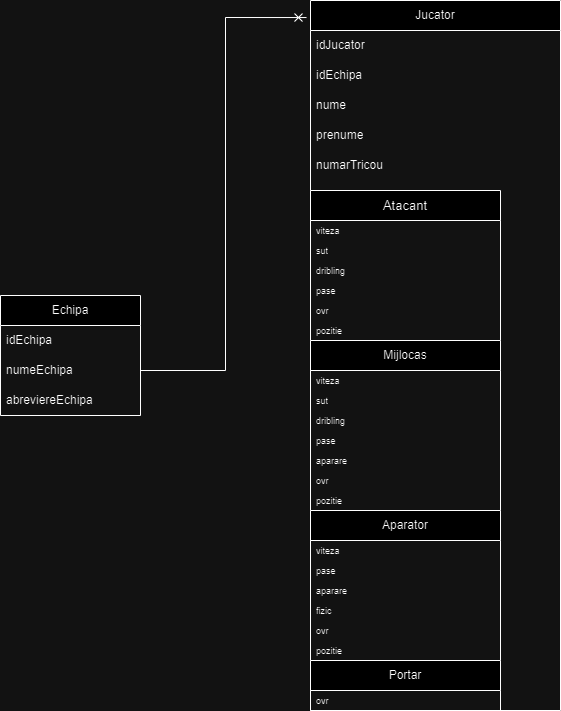

# Football Simulator
Project made in Java. It consists of console game capable 
of simulating a league of 10 teams(one of which is 
controlled by the user). After you get pass the main screen,
you will need to enter the name of the team. The program
will generate a random team consisting of 11 players:
- 1 goalkeeper
- 4 defenders
- 3 midfielders
- 3 attackers

Their names are random selected from two list: one with
**first names** and one with **last names**, both being
in romanian. The stats are also random generated.

## In-game menu
The player has 3 choices from this point:
1. To simulate one stage. 
> In this version the only event it generates is the **GOAL**
> event. It is a balanced on the team overall rating, with
> attackers having the higher chance of scoring.
2. To display the league table.
3. To close the program.

## Database and Audit
### Database
The relations from the database schema:
1. One-to-Many: Echipa - Jucator
2. IS-A:
- Atacant - Jucator
- Mijlocas - Jucator
- Aparator - Jucator
- Portar - Jucator

The database is populated with 9 teams from the history
of Romanian Superliga(Liga 1):
- FC Steaua Bucuresti
- CFR Cluj
- Universitatea Craiova
- FC Dinamo Bucuresti
- FC Rapid Bucuresti
- FC Viitorul Constanta
- Astra Giurgiu
- FC Botosani
- Sepsi OSK Sfantu Gheorghe

Each team has 11 players, as listed above.

### Audit
The audit has the role of keeping track of every game
interaction, from displaying the standings, to keep
record of every game simulated.